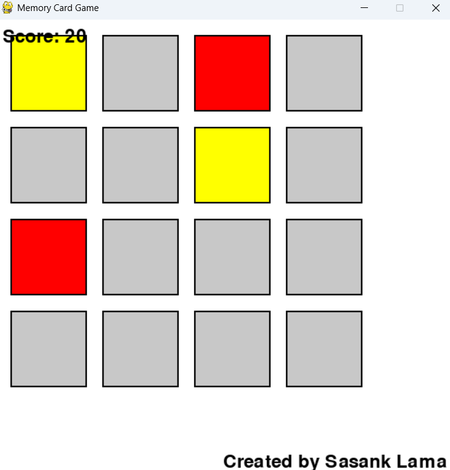

# 🧠 Memory Card Game 🎮

A simple memory card matching game built with Python and Pygame. Flip cards to find matching pairs and test your memory!

---

## 🌟 Features

- **🎲 4x4 Grid** of colored cards
- **🔀 Randomized Card Placement** each game
- **📊 Score Tracking** (+10 points for each match)
- **🏆 Win Detection** with automatic game reset
- **🎨 Simple, Colorful Graphics**

---

## 📸 Screenshots

 

---

## 🕹️ How to Play

1. **🖱️ Click** on any two cards to reveal their colors
2. **✅ Match** cards to keep them revealed and earn points
3. **🕒 Wait** briefly if cards don't match
4. **🔁 Continue** until all pairs are found
5. **🎉 Celebrate** when you win!

---

## ⚙️ Requirements

- **🐍 Python 3.x** 
- **🎮 Pygame Library**

---

## 🛠️ Installation
Clone this repository using the command below (click the copy button in the top right corner):

```bash
git clone https://github.com/Sasank-5716/Pygames.git
```
```bash
cd Pygames/Memorycard_game
```

## 🚀 Running the Game
Install dependencies:

```bash
pip install pygame
```

Run the game:

```bash
python memory_card_game.py
```
---

## 🧑💻 Code Overview

- **🔳 Grid:** 4x4 cards (each color appears twice)
- **🧠 Logic:** Click handling and matching system
- **💯 Scoring:** +10 points per successful match
- **🔄 Reset:** Automatic shuffle on win

---

## 🎨 Customization

- **🌈 Colors:** Modify the `COLORS` list
- **📐 Dimensions:** Adjust `rows`, `cols`, `card_width`, `card_height`
- **✨ Enhancements:** Add sounds/images with Pygame's mixer and image modules

---

## 🙏 Acknowledgments

- Built with **❤️** and **🐍 Pygame**
- Inspired by classic **🧩 Memory Games**

**Enjoy the game!** 🎮✨
