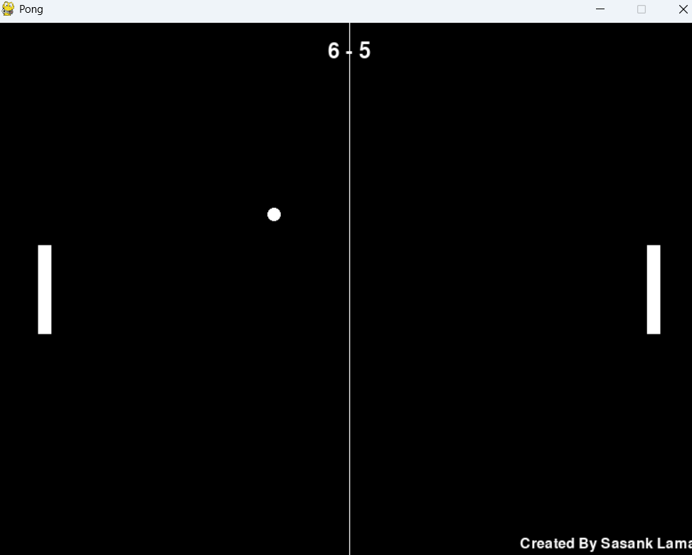

# 🏓 Pong Game

A classic Pong game built with Pygame where the first player to score 10 points wins.

## 📸 Screenshots

 

## 🎮 Features
- Player vs Player gameplay
- First to 10 points wins
- Controls displayed at start
- ESC key to exit anytime
- Clean and simple interface

## ⚙️ Installation
1. Make sure you have Python 3.8+ installed
2. Clone this repository:
```bash
git clone https://github.com/Sasank-5716/Pong.git
```
## Install dependencies:
```bash
pip install -r requirements.txt
```

## 🕹️ How to Play
Player 1 (Left Paddle): W (up), S (down)

Player 2 (Right Paddle): ↑ (up), ↓ (down)

Start Game: Press SPACE

Exit Game: Press ESC

## 🏆 Winning
First player to score 10 points wins the game!
