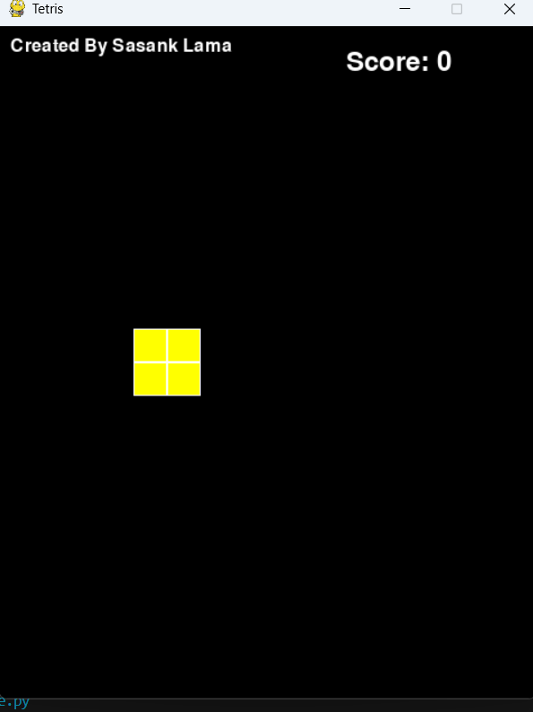

# 🟦 Tetris Game 🎮

A classic Tetris puzzle game built with Python and Pygame! Arrange falling blocks (tetrominoes) to clear lines and score points. The game gets faster as you progress-how long can you last?

[](https://python.org)
[](https://pygame.org)


---

## 🎮 Features

- **🧩 Classic Tetris gameplay**: Rotate and move tetrominoes to fill lines
- **🚀 Increasing speed**: The game gets harder as you clear more lines
- **🏆 Score tracking**: See your score and high score in real time
- **🎨 Colorful graphics**: Each tetromino has a unique color
- **🔄 Replayable**: Restart anytime for endless fun

---

## 🖼️ Screenshots

  

---

## 🛠️ Installation

**Clone and play instantly:**
```bash
git clone https://github.com/yourusername/tetris-game.git
```
```bash
cd tetris-game
```
Install Pygame
```bash
pip install pygame

## 🚀 Running the Game
```bash
python tetris.py
```

## 🕹️ How to Play

- **⬅️ ➡️**: Move tetromino left/right
- **⬆️**: Rotate tetromino
- **⬇️**: Soft drop (move down faster)
- **Space**: Hard drop (drop instantly)
- **Q**: Quit the game

**Goal:**  
Fill horizontal lines with blocks. Completed lines disappear and score points. The game ends if the stack reaches the top.

---

## 🧠 Code Highlights

- **Object-Oriented Design**: Classes for Tetromino, Game Board, and Game Logic[5][8]
- **Randomized Tetrominoes**: Each new piece is randomly chosen[6][7]
- **Collision Detection**: Prevents illegal moves and handles line clears[4][6]
- **Game Loop**: Handles user input, piece movement, and rendering[4][7]

---

## 🛠️ Customization

- **Change Colors**: Edit the color constants at the top of the script
- **Adjust Board Size**: Modify grid size and screen dimensions
- **Add Sound Effects**: Use `pygame.mixer` for music and effects

---

**Enjoy the game and challenge your high score!** 🏆