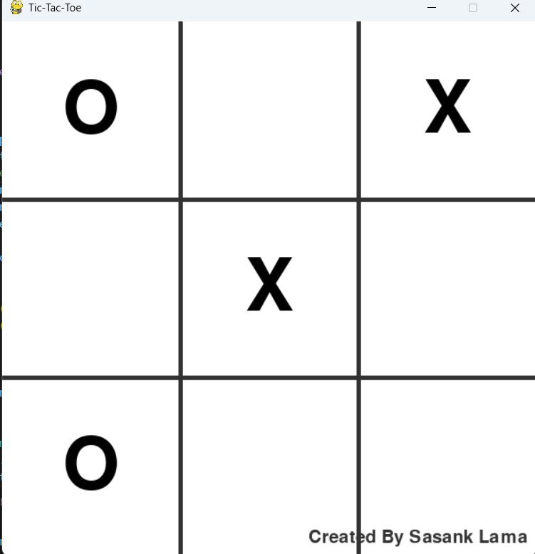

# ⭕ Tic-Tac-Toe Game ❌  
A classic two-player implementation of Tic-Tac-Toe built with Python and Pygame. Play against a friend on the same device!

[](https://python.org)  
[](https://pygame.org)  

---

## 🎮 Features  
- **👥 Two-Player Mode**: Alternate turns between X and O  
- **🏆 Win Detection**: Instant recognition of 3-in-a-row  
- **🎨 Minimalist Design**: Clean grid and smooth animations  
- **🔄 Restart Option**: Quick replay with one click  
- **📊 Score Tracking**: Wins for X and O displayed  


## 🖼️ Screenshots  
  
---

## 🛠️ Installation  
**Clone and play:** 
```bash 
git clone https://github.com/Pygames.git
```
```bash
cd TicTacToe
```
```bash
pip install pygame
```

## 🚀 Running the Game  
```bash
python tictactoe.py
```

## 🕹️ How to Play  
1. **Players alternate turns**: X starts first  
2. **Click any empty square** to place your mark  
3. **First to get 3 in a row** (horizontal, vertical, or diagonal) wins  
4. **Press R** to restart the game  
5. **Press Q** to quit  
---

## ⚙️ Project Structure  
tic-tac-toe/
│
├── tictactoe.py # Main game logic
├── requirements.txt
├── README.md
└── Tictactoe.png 
---

## 🧠 Code Highlights  
- **Grid System**: 3x3 board with precise click detection  
Calculate grid position from mouse click
col = mouse_pos // (WIDTH // 3)
row = mouse_pos // (HEIGHT // 3)

- **Win Condition Check**:  
Check all 8 possible winning combinations
win_conditions = [
# Rows
[(0,0), (0,1), (0,2)],
[(1,0), (1,1), (1,2)],
[(2,0), (2,1), (2,2)],
# Columns
[(0,0), (1,0), (2,0)],
# ... etc ...
]


- **Restart Logic**: Reset board with one keypress  
if event.key == pygame.K_r:
board = [[None for _ in range(3)] for _ in range(3)]
---

## 🛠️ Customization  
- **Player Color**: Modify X (red) and O (blue) RGB values  
- **Grid Size**: Change WIDTH/HEIGHT for bigger board  
- **AI Opponent**: Add single-player mode with minimax algorithm  
def minimax(board, depth, is_maximizing):
---

**May the best strategist win!** 🧠⚡
